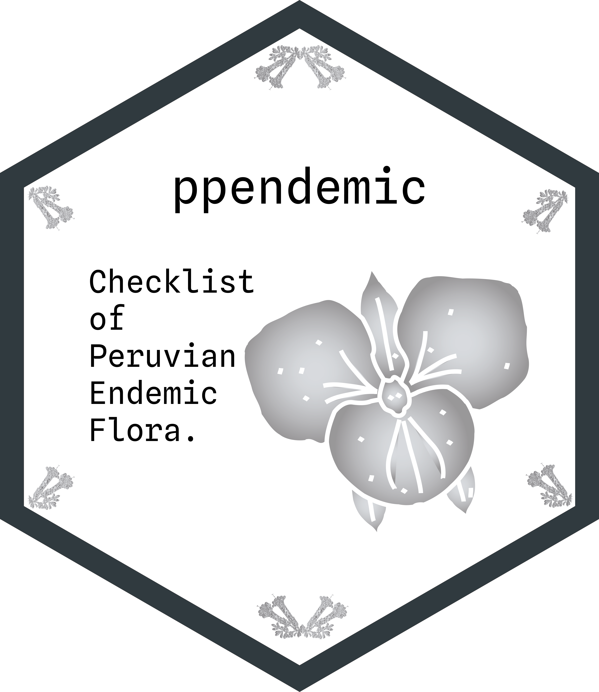

## ppendemic 

`ppendemic` reune una base de datos actualizada de plantas endemicas del Peru y la pone a disposicion en un formato util para consulta, analisis y trabajo reproducible.

El proyecto resume una compilacion botanica revisada con mas de 7,800 especies, pensada para personas que necesitan:

- consultar rapidamente la flora endemica del pais
- integrar nombres y listados en analisis floristicos
- apoyar procesos de priorizacion y conservacion

Es un proyecto orientado a hacer mas accesible y reutilizable una parte central de la diversidad botanica del Peru.

