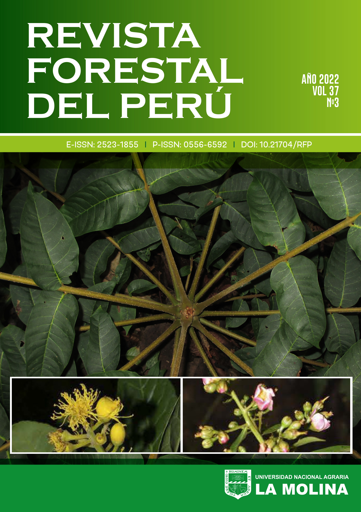

## perutimber 

`perutimber` convierte en un recurso abierto la informacion del trabajo `Catalogo de las especies forestales maderables de la Amazonia y la Yunga Peruana`. El paquete facilita la consulta de una sintesis taxonomica clave para especies maderables del Peru y permite llevar esa informacion a analisis reproducibles.

El catalogo integra 1,311 especies construidas a partir de literatura especializada, catalogos nacionales y observaciones de campo. Esto hace que `perutimber` sea especialmente util para:

- organizar listados de especies maderables
- trabajar con referencias taxonomicas para inventarios y reportes
- apoyar investigaciones y proyectos aplicados en bosques amazonicos y yungas peruanas

## Citation

- Si usas `perutimber` en una publicacion, cita la referencia original:

Vásquez Martínez, R., & Rojas Gonzáles, R. D. P. . (2022). Catálogo de las especies forestales maderables de la Amazonía y la Yunga Peruana. Revista Forestal Del Perú, 37(3), 5-138. [https://doi.org/10.21704/rfp.v37i3.1956](https://doi.org/10.21704/rfp.v37i3.1956)

