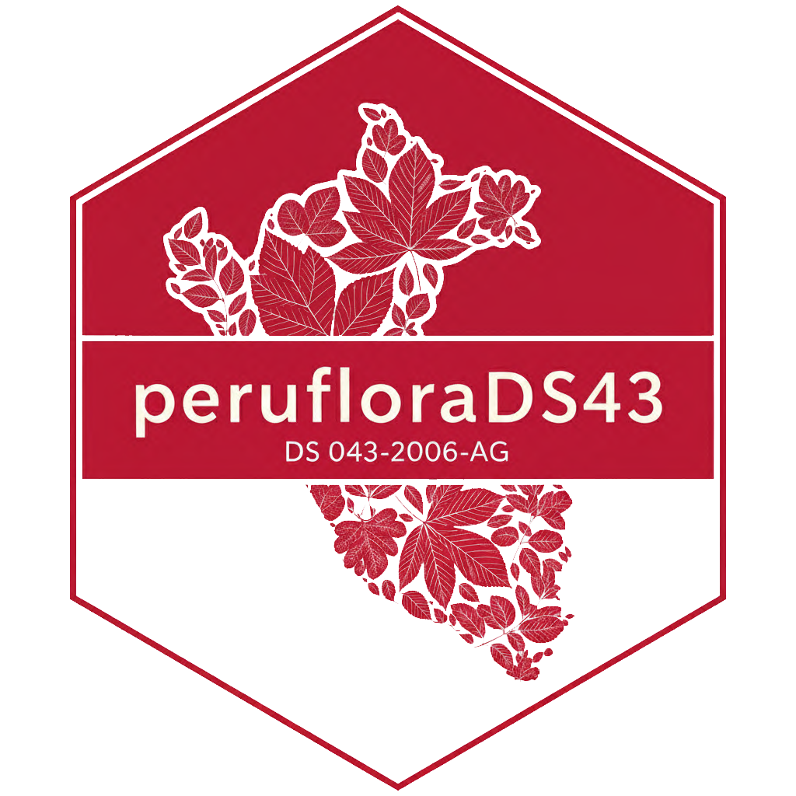

## peruflorads43 

`peruflorads43` ayuda a consultar y analizar de forma mas clara la informacion asociada al `Decreto Supremo No. 043-2006-AG`, que categoriza especies amenazadas de flora silvestre en el Peru. El objetivo es convertir una fuente legal y tecnica en un recurso util para trabajo reproducible.

El paquete permite:

- explorar la lista oficial de especies categoricas
- trabajar con nombres actualizados y validos
- integrar la norma en analisis, reportes y evaluaciones
- acercar la informacion legal a investigacion y conservacion aplicada

Es una herramienta especialmente util para investigadores, consultores y personas que necesitan conectar normativa, taxonomia y datos de biodiversidad en un mismo flujo de trabajo.

