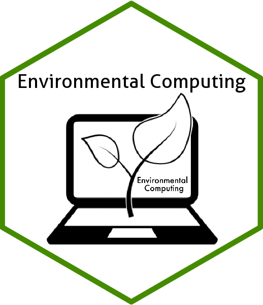

## Environmental Computing 

Este proyecto presenta una version en espanol del sitio web `Environmental Computing`, un recurso pensado para aprender a usar R en la gestion, analisis y visualizacion de datos ambientales.

El valor de este trabajo esta en acercar contenidos tecnicos a una audiencia hispanohablante que necesita desarrollar habilidades practicas para:

- manipular datos ambientales
- analizar informacion biologica de forma reproducible
- generar visualizaciones utiles para investigacion y reporte
- fortalecer capacidades en ciencias biologicas y ambientales

Es un proyecto orientado a formacion y transferencia de conocimiento, complementario a los paquetes y herramientas que desarrollo en este sitio.

## Environmental Computing original

- Puedes explorar el sitio original [aqui](https://environmentalcomputing.net/)

